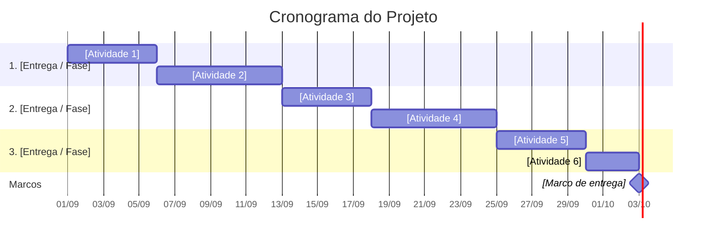

# 📅 Cronograma do Projeto

---

## 📌 Identificação

| Campo | Informação |
|---|---|
| **Projeto** | [Nome do projeto] |
| **Gerente do projeto** | [Nome] |
| **Data de elaboração** | [DD/MM/AAAA] |
| **Versão** | [1.0] |
| **Início previsto** | [DD/MM/AAAA] |
| **Término previsto** | [DD/MM/AAAA] |

---

## 📊 Cronograma



> **Atenção:** substitua as atividades, datas e durações de acordo com o projeto.

---

## 📋 Lista de Atividades

| ID | Atividade | Início | Término | Duração | Responsável | Dependência | Status |
|---|---|---|---|---:|---|---|---|
| A1 | [Atividade] | [DD/MM] | [DD/MM] | [X dias] | [Nome] | — | ⬜ Não iniciada |
| A2 | [Atividade] | [DD/MM] | [DD/MM] | [X dias] | [Nome] | A1 | ⬜ Não iniciada |
| A3 | [Atividade] | [DD/MM] | [DD/MM] | [X dias] | [Nome] | A2 | ⬜ Não iniciada |
| A4 | [Atividade] | [DD/MM] | [DD/MM] | [X dias] | [Nome] | A3 | ⬜ Não iniciada |
| A5 | [Atividade] | [DD/MM] | [DD/MM] | [X dias] | [Nome] | A4 | ⬜ Não iniciada |
| A6 | [Atividade] | [DD/MM] | [DD/MM] | [X dias] | [Nome] | A5 | ⬜ Não iniciada |

---

## 🔗 Dependências

As dependências representam relações entre atividades. Uma atividade pode depender da conclusão de outra para ser iniciada.

### 📌 Exemplo

```text
A1 — Levantamento de requisitos
 ↓
A2 — Definição da solução
 ↓
A3 — Desenvolvimento
 ↓
A4 — Testes
 ↓
A5 — Implantação
```

### 📋 Dependências do projeto

| Atividade | Depende de | Relação |
|---|---|---|
| A1 | — | Início do projeto |
| A2 | A1 | Após conclusão de A1 |
| A3 | A2 | Após conclusão de A2 |
| A4 | A3 | Após conclusão de A3 |
| A5 | A4 | Após conclusão de A4 |

---

## 🚩 Marcos do Projeto

Marcos representam acontecimentos importantes do projeto. Eles não possuem duração significativa e indicam pontos relevantes para acompanhamento.

| Marco | Data prevista | Critério |
|---|---|---|
| 🚀 Início do projeto | [DD/MM/AAAA] | Projeto autorizado |
| 📋 Planejamento concluído | [DD/MM/AAAA] | Plano aprovado |
| 📦 Primeira entrega | [DD/MM/AAAA] | Entrega aceita |
| 🧪 Testes concluídos | [DD/MM/AAAA] | Critérios atendidos |
| 🏁 Encerramento | [DD/MM/AAAA] | Projeto finalizado |

---

## 👥 Responsáveis

| Responsável | Atividades |
|---|---|
| [Nome] | [A1, A2] |
| [Nome] | [A3] |
| [Nome] | [A4, A5] |

---

## 📊 Acompanhamento

O cronograma deve ser atualizado durante a execução do projeto para comparar o planejamento com o andamento real.

| ID | Atividade | Planejado | Realizado | Situação |
|---|---|---:|---:|---|
| A1 | [Atividade] | 100% | [X%] | 🟢 |
| A2 | [Atividade] | 80% | [X%] | 🟡 |
| A3 | [Atividade] | 50% | [X%] | 🟡 |
| A4 | [Atividade] | 20% | [X%] | 🔴 |

### 📌 Legenda

- 🟢 **No prazo**
- 🟡 **Atenção**
- 🔴 **Atrasado**
- ⬜ **Não iniciado**
- 🔵 **Concluído**

---

## ⚠️ Atrasos e Ações

| Atividade | Problema | Impacto | Ação planejada |
|---|---|---|---|
| [ID] | [Problema] | [Impacto] | [Ação] |
| [ID] | [Problema] | [Impacto] | [Ação] |

---

## 📝 Observações

[Registre aqui informações relevantes sobre alterações, atrasos, antecipações ou outros acontecimentos que possam afetar o cronograma.]

---

## ✅ Checklist

- [ ] Todas as atividades foram identificadas
- [ ] As atividades possuem responsáveis
- [ ] As datas de início foram definidas
- [ ] As datas de término foram definidas
- [ ] As durações foram estimadas
- [ ] As dependências foram identificadas
- [ ] Os principais marcos foram definidos
- [ ] O cronograma foi revisado
- [ ] O cronograma foi atualizado durante a execução
- [ ] Os atrasos e impactos foram registrados
